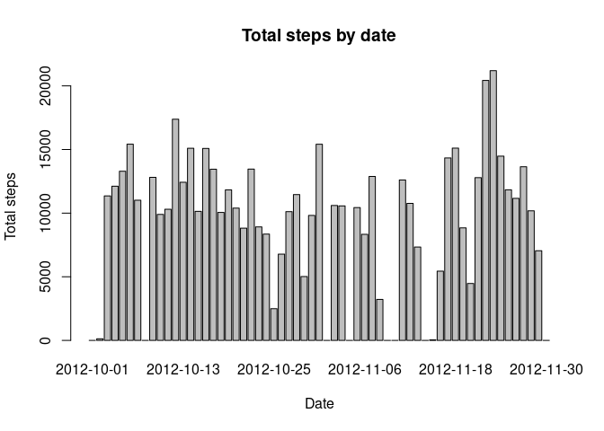
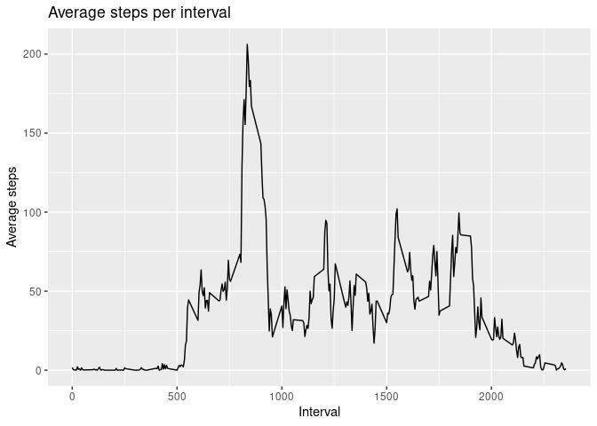
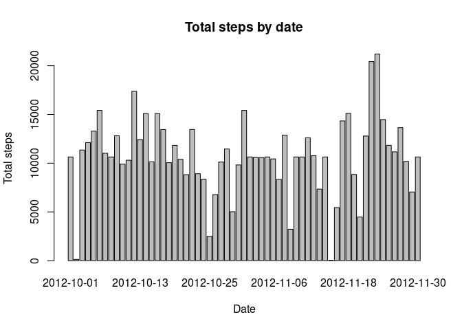
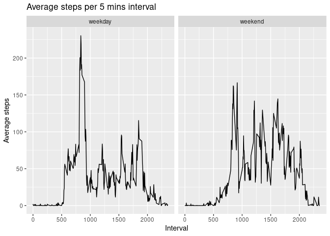

This assignment makes use of data from a personal activity monitoring device. This device collects data at 5 minute intervals through out the day. The data consists of two months of data from an anonymous individual collected during the months of October and November, 2012 and include the number of steps taken in 5 minute intervals each day.

The variables included in this dataset are:

- steps: Number of steps taking in a 5-minute interval (missing values are coded as NA)

- date: The date on which the measurement was taken in YYYY-MM-DD format

- interval: Identifier for the 5-minute interval in which measurement was taken

The dataset is stored in a comma-separated-value (CSV) file and there are a total of 17,568 observations in this dataset.

Before starting, some preprocessing to assure the good functioning


```r
library(dplyr)
library(ggplot2)
```

## Loading and preprocessing the data

Question 1 : First step is to load the data. We cast the date column as date because it was treated as character


```r
data <- read.csv("activity.csv")
data$date <- as.Date(data$date)
summary(data)
```

```
##      steps             date               interval     
##  Min.   :  0.00   Min.   :2012-10-01   Min.   :   0.0  
##  1st Qu.:  0.00   1st Qu.:2012-10-16   1st Qu.: 588.8  
##  Median :  0.00   Median :2012-10-31   Median :1177.5  
##  Mean   : 37.38   Mean   :2012-10-31   Mean   :1177.5  
##  3rd Qu.: 12.00   3rd Qu.:2012-11-15   3rd Qu.:1766.2  
##  Max.   :806.00   Max.   :2012-11-30   Max.   :2355.0  
##  NA's   :2304
```

## What is mean total number of steps taken per day?

We want to know the mean total number of steps taken per day

Questions 2 : First we are plotting the total steps taken per day to have a first impression


```r
total_steps_per_day <- data %>% group_by(date) %>% summarize(total_steps = sum(steps, na.rm = TRUE))
barplot(
    total_steps_per_day$total_steps, 
    names.arg = total_steps_per_day$date,
    main="Total steps by date",
    xlab = "Date",
    ylab = "Total steps"
)
```

<!-- -->

Question 3 : We calculate the mean and median steps taken per day

```r
total_steps_mean_per_day = mean(total_steps_per_day$total_steps)
total_steps_median_per_day = median(total_steps_per_day$total_steps)
```

**The average steps made per day are 9354.2295082 and the median is 10395**

## What is the average daily activity pattern?

Question 4 : We make a time series plot of the 5-minute interval (x-axis) and the average number of steps taken, averaged across all days (y-axis)


```r
mean_steps_per_interval <- data %>% group_by(interval) %>% summarize(average_steps = mean(steps, na.rm = TRUE))
ggplot(mean_steps_per_interval, aes(interval, average_steps)) + 
    geom_line() + 
    labs(title = "Average steps per interval", x="Interval", y="Average steps")
```

<!-- -->

Question 5 : we want to know which 5-minute interval, on average across all the days in the dataset, contains the maximum number of steps


```r
max_average_steps_row = mean_steps_per_interval[which.max(mean_steps_per_interval$average_steps),]
```

**The max average steps made per interval are 206.1698113 in the interval 835**

## Imputing missing values

To know how many missing data values are there, we can check the summary


```r
summary(data)
```

```
##      steps             date               interval     
##  Min.   :  0.00   Min.   :2012-10-01   Min.   :   0.0  
##  1st Qu.:  0.00   1st Qu.:2012-10-16   1st Qu.: 588.8  
##  Median :  0.00   Median :2012-10-31   Median :1177.5  
##  Mean   : 37.38   Mean   :2012-10-31   Mean   :1177.5  
##  3rd Qu.: 12.00   3rd Qu.:2012-11-15   3rd Qu.:1766.2  
##  Max.   :806.00   Max.   :2012-11-30   Max.   :2355.0  
##  NA's   :2304
```

We have only missing values in the steps column, with 2304 rows missing this value. We obtain the same information with the following code :


```r
sum(is.na(data$steps))
```

```
## [1] 2304
```

Question 6 : To fill the missing values, we could think of just adding the mean of the day. Nevertheless, some days, like the 1st October, have none so it is not possible. Let's just input the mean calculated for the interval if the data is missing.


```r
filled_data <- merge(data, mean_steps_per_interval, by.x = "interval", by.y = "interval")
filled_data <- rename(filled_data, average_interval_steps = average_steps) 
filled_data$steps <- floor(coalesce( filled_data$steps,filled_data$average_interval_steps))
```

Question 7 : We want to compare the results of the first part with the same process on the new data set.


```r
total_steps_per_day_data_filled <- filled_data %>% group_by(date) %>% summarize(total_steps = sum(steps, na.rm = TRUE))
barplot(
    total_steps_per_day_data_filled$total_steps, 
    names.arg = total_steps_per_day_data_filled$date,
    main="Total steps by date",
    xlab = "Date",
    ylab = "Total steps"
)
```

<!-- -->

We calculate the mean and median steps taken per day


```r
total_steps_mean_per_day_data_filled = mean(total_steps_per_day_data_filled$total_steps)
total_steps_median_per_day_data_filled = median(total_steps_per_day_data_filled$total_steps)
```

**The average steps made per day are 1.074977\times 10^{4} and the median is 1.0641\times 10^{4} compared with the results before average : 9354.2295082, median : 10395** As expected this values grow since values treated before as zeros now have positive values. 

## Are there differences in activity patterns between weekdays and weekends

We add a column with a factor if the day is a weekday or a weekend and group by this new variable


```r
filled_data$day_type <- factor(ifelse(weekdays(filled_data$date) %in% c("sábado","domingo"), "weekend", "weekday"))
steps_mean_by_day_type_interval <- summarize(group_by(filled_data, day_type, interval), average_steps = mean(steps))
```

```
## `summarise()` has grouped output by 'day_type'. You can override using the
## `.groups` argument.
```

Question 8 : Let's create a panel plot comparing the average number of steps taken per 5-minute interval across weekdays and weekends


```r
g <- ggplot(steps_mean_by_day_type_interval, aes(interval,average_steps) )
g + geom_line() + facet_grid(.~day_type) + labs(
  title="Average steps per 5 mins interval",
  x="Interval",
  y="Average steps"
  )
```

<!-- -->
